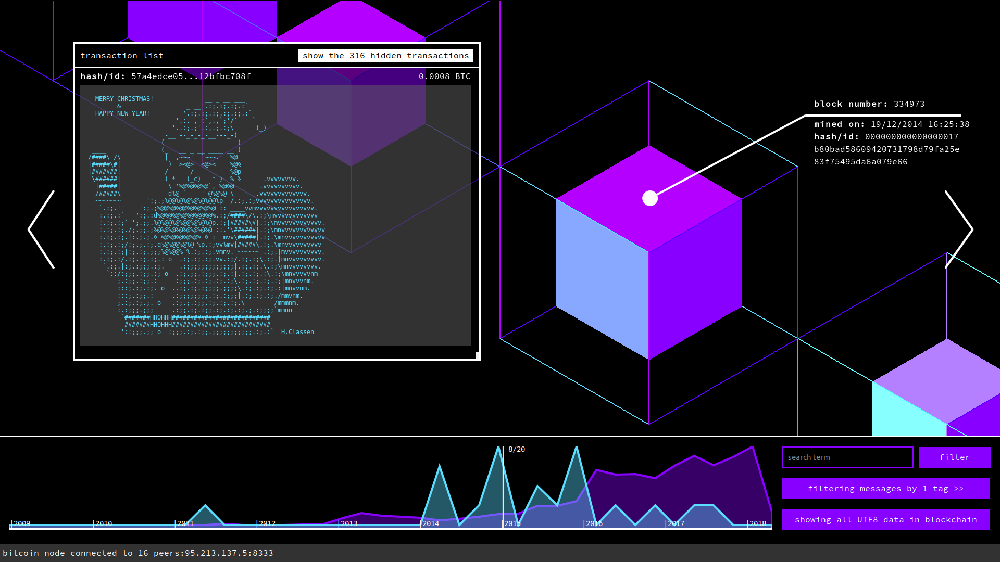

# Messages from the Mines



*Messages from the Mines* is an interactive art installation that excavates and interprets custom messages embedded in the Bitcoin blockchain. The distributed ledger contains hidden love messages, cryptic poems, ASCII art, signatures, eulogies and more. These messages are a creative misuse of the Bitcoin transaction protocol, a form of digital graffiti, unique—though overlooked—cultural artifacts forever embedded in one of the most contemporary digital technologies. 

Our project looks at the Bitcoin blockchain not from the traditional perspective of investors or programmers, but rather from a cultural perspective. We've built a system for extracting, archiving, researching, interpreting and annotating the messages left behind and document the evolution of this creative re-purposing of the blockchain. We approach this task not only as artists but also as anthropologists conducting contemporary media archeology; we seek an anthropological understanding of this phenomenon. Who are leaving these messages? What are their motivations and sentiments? What forms of anonymous communication occur on the ledger?

For more information about about the project, see [this large poster](.images/banner.png). 

## Install

This repository is comprised entirely of git submodules of other repositories. 

- `mftm-backend`: The Node.js backend server that hosts our frontend, REST API, and our internal message review tool.
- `mftm-frontend` (located in `mftm-backend/www/mftm-frontend`): The UI for exploring the blockchain messages (pictured above).
- `mftm-database`: Python code for extracting messages from the blockchain (using `bitcoind`'s `.dat` files) and constructing the MySQL database used by `mftm-backend`. 

```bash
# clone this repo
git clone https://github.com/brangerbriz/messages-from-the-mines
cd messages-from-the-mines

# if you are on this branch we assume you want to install the web version
# of the project (not the physical installation version).
git checkout -b web
git pull origin web

# recursively init and download the submodules
git submodule update --init --recursive --remote

# you will notice that there are 4 submodules, two in the parent
# repo, each that contains one additional submodule.
git submodule status --recursive
```

These install instructions are for Ubuntu 16.04. Other OSes may work but are not officially supported: here be dragons.

### Setting up the MySQL Database

```bash
# install mysql and optional GUI helpers
sudo apt update
sudo apt install mysql-server mysql-workbench
```

Now download the latest `messages_from_the_mines` database backup from [here (direct download)](https://github.com/brangerbriz/mftm-database/releases/download/data/latest.sql.gz). Unzip that file and you should get an `.sql` file like `2018-04-18.sql`.

```bash
# download the latest version of the database
curl -L https://github.com/brangerbriz/mftm-database/releases/download/data/latest.sql.gz > latest.sql.gz

# unzip it
gunzip latest.sql.gz

# import the database backup (be sure to use the correct path to your database file)
# this will create a new Database schema called messages_from_the_mines
mysql -u root -p < latest.sql
```

You may optionally create a new MySQL user to interface with the `messages_from_the_mines` database only. This is probably a good idea, as you have to save your database username/password in plaintext in `mftm-backend/config.json` and `mftm-database/config.json` (if actually want to parse the blockchain from this computer). This process is trivial using MySQL Workbench. Just be sure that your new user has full access permissions to the `messages_from_the_mines` database schema.

### Setting up the `mftm-backend` Node.js server

Once you've configured the MySQL database, detailed instructions to setup the backend server can be found in the [`mftm-backend/README.md`](https://github.com/brangerbriz/mftm-backend) file. You should now follow those instructions before returning here.

## Run

### The backend

In one terminal, run:

```
# start the bitcoin daemon
cd mftm-backend
./start_bitcoind.sh
```

In another terminal run:

```
# still inside mftm-backend
node server
```

### The Frontend/UI

So, this really isn't the most elegant solution... but it's the one we are supporting as of right now. Because of an HTTP (not HTTPS) call that we have to make to use the ipstack geo-ip API, browsers throw a "Mixed Content" error if loaded over HTTPS. We built the whole thing to run on HTTPS (w/ basic auth and everyting) and to run it via HTTP would cause some security concerns, as people could read the contents of our `mftm-backend/www/auth.js` file. For now, our solution is to open `mftm-backend/www/mftm-frontend/index.html` in Firefox using `file://` and NOT serve the UI.

```
# from inside this repo's root

# copy the auth.js file to where Nick originally expected it to
# be while he was dev'n
cp mftm-backend/www/auth.js mftm-backend/www/mftm-frontend/js/auth.js

firefox mftm-backend/www/mftm-frontend/index.html
```

Sorry folks, that's just the way it goes sometimes.

## Docker Install

The web version of this project can be installed via Docker using the `web-docker` branch by following the instructions below.

```bash
git clone https://github.com/brangerbriz/messages-from-the-mines
cd messages-from-the-mines
git checkout web-docker
git submodule update --init --recursive

# open .env in a text editor and create and add a password for
# BASIC_AUTH_PASSWORD and MYSQL_ROOT_PASSWORD
nano .env

# launch the nginx http proxy running on port 80. We'll need this to get
# an HTTPS certificate.
docker-compose up -d http-proxy

# create an HTTPS/SSL/TLS certificate with Let's Encrypt
DOMAIN=example.org EMAIL=email@example.org ./scripts/create_cert.sh

# if this errors with "ERROR: No containers to restart", that's fine
DOMAIN=example.org DOCKER_USER=$USER ./scripts/reload_cert.sh

docker-compose up -d

# enter the password value you just created for MYSQL_ROOT_PASSWORD in .env when prompted
docker-compose exec db sh -c "mysql -u root -p < /latest-web.sql && rm /latest-web.sql"
```

```bash
# add a root cronjob
sudo crontab -e 

# past these contents (and replace the placeholder vars). 
# Each day at 7PM attempt to renew the HTTPS certificate and reboot the node server
0 19 * * * ./scripts/renew_cert.sh && DOMAIN=example.org DOCKER_USER=example-user ./scripts/reload_cert.sh
```

## More Info


